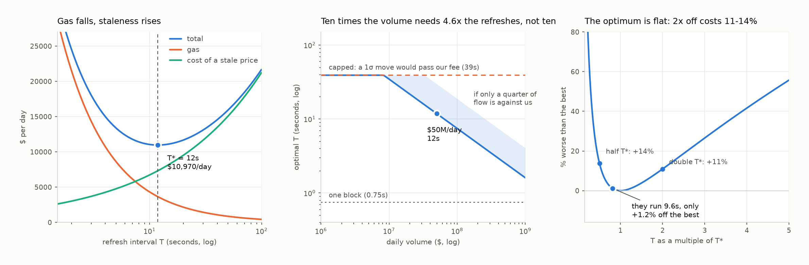

# Part 2 — Optimal Refresh Frequency

How often should the bot push a new price on-chain?

```bash
make part2      # prints the results and writes refresh_model.png
```

## The trade-off

Refresh often and the gas bill grows. Refresh rarely and the on-chain price
drifts away from the real market, so people trade against us at the wrong price.
One cost falls with the interval, the other rises. We want the bottom of the sum.

## Objective function

Let `T` be the seconds between refreshes.

```
maximise    Π(T)  =  V·f  −  G/T  −  A(T)

    V  = volume through the pool, $ per second
    f  = fee we charge (5 bps)
    G  = gas cost of one refresh ($0.50)
    A  = what a stale price costs us, $ per second
```

Fee income `V·f` does not depend on `T`, so this is the same as **minimising**

```
    C(T)  =  G/T  +  A(T)
```

## Deriving A(T)

At time `t` after a refresh the on-chain price is wrong by `ε(t)`, which for a
random walk is normally distributed with standard deviation `σ√t`. Trades keep
arriving at rate `V` throughout, and each one costs us the error at that moment:

```
    E|ε(t)|            = σ√t · √(2/π)

    cost over [0, T]   = ∫₀ᵀ V · σ√t · √(2/π) dt
                       = V·σ·√(2/π)·(2/3)·T^(3/2)

    A(T)               = that ÷ T  =  c·V·σ·√T ,    c = (2/3)√(2/π) ≈ 0.532
```

So the full problem is

```
    minimise    C(T) = G/T + c·V·σ·√T        over T > 0
```

The `√T` matches the brief's stated assumption. It comes from two averagings:
`√(2/π)` turns a standard deviation into an average distance moved, and `2/3`
averages `√t` over the interval, because traders arrive throughout it rather
than only at the end.

## Solving

```
    C'(T)  =  −G/T²  +  c·V·σ / (2√T)  =  0

              ┌               ┐ 2/3
    T*   =    │    2G         │
              │ ─────────     │
              │  c·V·σ        │
              └               ┘

    C''(T*) = (3/4)·c·V·σ·T*^(-3/2)  >  0      → a minimum, and C is convex,
                                                 so it is the only one
```

Two properties worth checking any implementation against:

- `T*` is proportional to `V^(-2/3)` — **ten times the volume needs 4.6× the
  refreshes, not ten.**
- At the optimum the stale-price cost is **exactly twice** the gas cost, at every
  volume. Falls straight out of the algebra.

## Constraints

```
    T  ≥  0.75 s              cannot refresh faster than one BSC block
    T  ≤  expiry              the contract rejects a price older than this
    T  ≥  G / budget          gas budget; = 9.6 s at their stated 7.2 BNB/day
    T  ≤  (f/σ)²  =  39 s     beyond this a one-sigma move exceeds our own fee
```

Only the first is a hard limit — the chain does not make blocks faster. The
second is a contract setting we choose, the third a policy choice, and the
fourth is not really a constraint at all.

**Expiry** is a safety check inside the contract: it stores the price with the
block it was written at and refuses to quote if that is too old, so a dead bot
makes the pool go quiet rather than go broke. `T` has to sit below it or we
switch ourselves off between refreshes. Choosing that number is Part 3's question.

**The budget line is not independent evidence** — its 9.6 s comes from dividing
their 7.2 BNB/day by their $0.50 per refresh, the same two numbers that give
"their current operating point". It never binds: the optimum spends less than the
budget allows.

**The last line is where the model stops being true, not a limit.** The cost
function already prices that loss, so imposing it would count it twice. Past that
point we stop attracting ordinary flow and start attracting arbitrage, whose size
is not bounded by everyday demand, so `V` is no longer constant. That is why the
volume table caps at 39 s.

At the given inputs the band is **0.75 s to 39 s** and the answer sits inside it,
so nothing is active.

## Inputs

| Input | Value | Source |
|---|---|---|
| Volume | $50M / day | given |
| Gas per refresh | $0.50 | given |
| Fee | 5 bps | given |
| Block time | 0.75 s | given |
| **Volatility σ** | **0.80 bps over one second** | **measured** |

`σ` is a per-`√`second quantity: a one-standard-deviation move is about 0.8 bps
over one second and `σ√T` bps over `T` seconds, which is about 45% a year. It is
not 0.8 bps *per* second — that would imply linear growth.

Measured from Binance's public price history for BNBUSDT in September 2026
(`measure_sigma.py`, or `make sigma`, re-runs it: the last 1,000 bars at each
size, standard deviation of log returns, divided by the square root of the bar
length). It depends on the window: 1.28 bps on one-second bars, 1.03 on
one-minute, 0.82 on five-minute, 0.67 on hourly, 0.95 on daily over 2.7 years —
a range of 37% to 72% a year. The one-second figure is the highest and the least
stable, which is expected: 1,000 one-second bars is only 17 minutes of data, and
at that resolution bid-ask bounce inflates measured volatility.

We use **0.80**, near the middle once the one-second bars are set aside. The
choice matters less than it looks: across the whole measured range, using 0.80
costs at most **2.5%** versus knowing the true value, because `T*` moves as
`σ^(-2/3)` while the cost curve is flat, and the two effects nearly cancel.

## Answer

**T\* ≈ 12 seconds**, about 16 BSC blocks, or 7,300 refreshes a day.

- Cost at the optimum: **$10,970/day** ($3,657 gas + $7,313 stale price)
- Against **$25,000/day** of fee income at 5 bps
- A one-standard-deviation move over that interval is 2.75 bps, comfortably
  under the 5 bps fee

**They currently refresh every 9.6 seconds — within 1.2% of the cheapest
possible.** Their setting is already right; the value here is the framework that
says so and tells them when to change it.

The optimum is also very flat. Being wrong by a factor of two costs 11-14%
(10.9% too slow, 13.8% too fast), so this is not a number worth chasing
precisely.



Left: the two costs and their sum against `T`. Middle: `T*` against volume, with
the band for how much of the flow is against us. Right: what a wrong `T` costs.

## How the answer moves with volume

| Daily volume | Refresh every | Blocks | Gas / day | 1σ move |
|---|---|---|---|---|
| $5M | 39 s *(capped)* | 52 | $1,106 | 5.0 bps |
| $25M | 19 s | 25 | $2,304 | 3.5 bps |
| **$50M** | **12 s** | **16** | **$3,657** | **2.7 bps** |
| $100M | 7 s | 10 | $5,805 | 2.2 bps |
| $500M | 2.5 s | 3 | $16,973 | 1.3 bps |

The $5M row is capped: the formula alone would wait 55 s, by which point a
one-sigma move exceeds our own fee.

## Should the 2-second Binance silence be treated as staleness?

**No.**

In two seconds a one-standard-deviation move in BNB is about **1.1 bps**. We
charge **5 bps**, so anyone trading against us during the gap still pays more
than the price moved; a 5 bps move inside two seconds is a 4.4σ event. And two
seconds is shorter than `T*` itself: the on-chain price is routinely up to 12 s
old by design, so a 2 s hole in the feed is well inside what we already accept.
Halting on every gap would stop trading for about 3% of the day to avoid a loss
that does not exist.

It becomes a real event only past about **39 seconds**, which is when a
one-standard-deviation move reaches our fee. The right response is a timer at
that threshold, not one that fires on every gap. Operationally the silence is
expected and periodic, so the feed-health timeout should sit above 2 s, or it
trips every minute on a healthy feed.

## The assumption doing the real work

The model needs one number we cannot measure: **how much of the flow is trading
against us on purpose.** We assume all of it — the most conservative reading, and
defensible because routers send us the wrong side whenever our price is off. It
is also the assumption that comes closest to their observed 9.6 s operating
point: all flow against us gives 12 s, a quarter gives 30 s.

If only a quarter of flow is against us, the answer moves to about 30 seconds.
The chart shows that band.

## What the brief leaves open

The brief asks that anything unclear be noted along with how it was handled.

- **Volatility is not given.** It is the input the answer is most sensitive to
  after volume, so we measured it from Binance rather than pick a number.
- **How much of the flow trades against us is not given.** We assume all of it,
  and show the sensitivity above.
- **"Spread: 5 bps" could mean two things** — the fee we charge, or the total
  we capture including curve slippage. We read it as the fee, which keeps Part 1
  and Part 2 consistent with each other.
- **Gas is treated as a constant.** In practice it moves with congestion and
  with the BNB price, and `T*` moves with it as `G^(2/3)`. We keep $0.50 because
  it is what the question specifies, and because it cross-checks against their
  stated 7.2 BNB/day: $4,514 at $0.50 each is one refresh every 9.6 seconds,
  matching the system as described.
